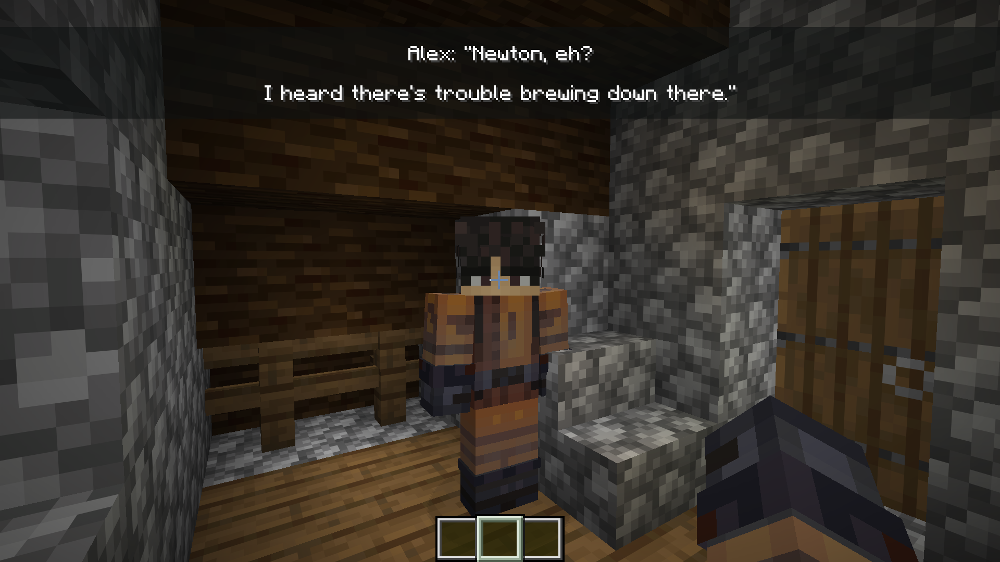

# Narrativa
> A dialogue engine for Minecraft.

[![GitHub][github-repo]][repo-url]

### What is Narrativa?
Narrativa is a datapack-based dialogue engine for Minecraft 1.21.11. It lets you write branching conversations / descriptions / flavour texts / and honestly whatever you can use it for, apparently. Made via Bolt, and uses `.bolt` modules to function. The engine handles the API functions, visuals, logic, and autodub for your convinience. You only have to give it stuff to work with.



## How to use it

A "dialogue" is made up of two building blocks: dialogue nodes and choice menus.

#### Dialogue node
```python
function username:dialog/example/greeting:
    Narrativa.new_dialog(
        lines=[
            ['Cee Vyte: "This is completely under', 'your control by the way.'],
            ''
        ],
        actions=[
            "",
            "function username:choice/example/greeting"
        ],
        autodub="username:dialog.example.greeting."
    )
```

`lines` - a list of text frames. Each entry is either a list of strings (a single raw json object, effectively just a /tellraw) or an empty string ('') for an auto-skipped frame.

`actions` - runs a command when that frame finishes. Empty strings do nothing. Index must match the corresponding entry in lines. Please make sure the amount of actions match the amount of lines, or otherwise there WILL be de-sync.

`autodub` - a namespace prefix for auto-resolving playsound commands. Narrativa appends the frame index automatically. Optional.

#### Choice menu
```python
function username:choice/example/greeting:
    choice_menu(
        title=  "Choice Menu Title:"
        options=[
            Choice(
                "Option A.",
                "say Chose: Option A!"
            ),
            Choice(
                "Option B.",
                "say Chose: Option B!"
            )
        ]
    )
```
Choice menu takes the display text and the command to run when the player picks it. Technically made for choices specifically, but you're free to misuse it as you wish.

#### Putting it together
Chains are built by having the last action in a node call either the next dialogue node or a choice menu. Mess around with the syntax and you'll get how it's done.
Swap `username` with your actual in-game name, and `example` with your project / namespace. 

## Development setup

It's all pretty simple, so just clone the latest stable version of the repository to start, and mess around with Bolt modules if needed.

```sh
curl -L https://github.com/DelightZone/narrativa/releases/latest/download/release.zip -o narrativa.zip
unzip narrativa.zip -d narrativa/
cd narrativa
pip install -r requirements.txt
```

## Meta

Cee Vyte – [@ceevyte](https://x.com/ceevyte) – kosoycded@example.com

Distributed under the GPL-3.0 license. See ``LICENSE`` for more information.

[https://github.com/DelightZone/narrativa](https://github.com/DelightZone/narrativa)

## Contributing

1. Fork it (<https://github.com/DelightZone/narrativa/fork>)
2. Create your feature branch (`git checkout -b feature/fooBar`)
3. Commit your changes (`git commit -am 'Add some fooBar'`)
4. Push to the branch (`git push origin feature/fooBar`)
5. Create a new Pull Request

<!-- Markdown link & img dfn's -->
[github-repo]: https://img.shields.io/badge/DelightZone-narrativa-blue?logo=github
[repo-url]: https://github.com/DelightZone/narrativa