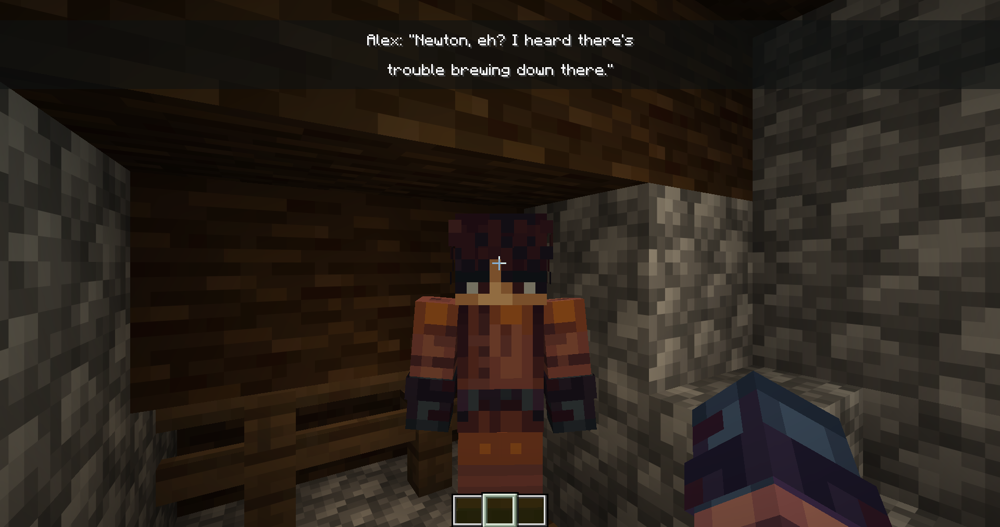

# Narrativa

[](README.md)
[](README_RU.md)

> A dialogue engine for Minecraft.

[![GitHub][github-repo]][repo-url]

### What is Narrativa?
Narrativa is a datapack dialogue engine for Minecraft 1.21.11. It lets you write branching conversations, descriptions, flavour text, or whatever else you want. It was made with Bolt and uses `.bolt` modules.

It handles API stuff, visuals, logic, and auto voice lines. You just feed it content and it does the rest.



## How to use it

A dialogue has two main parts: dialogue nodes and choice menus.

### Dialogue node
```Python
function username:dialog/example/greeting:
    Narrativa.new_dialog(
        lines=[
            ['Cee Vyte: "This is completely under', 'your control, by the way.'],
            ''
        ],
        actions=[
            "",
            "function username:choice/example/greeting"
        ],
        autodub="username:dialog.example.greeting."
    )
```
`lines` is the text shown each frame. Each item is either a list of strings (like a /tellraw message) or an empty string for a skipped frame.

`actions` runs commands after each frame. Empty strings do nothing. Each action must match a line or things break and go out of sync.

`autodub` is a prefix for autoplay of the current frame's sound. It handles the frame index automatically. You can skip this if you want.

### Choice menu
```Python
function username:choice/example/greeting:
    choice_menu(
        title="Choice Menu Title:",
        options=[
            Choice(
                "Option A.",
                "say Chose: Option A!"
            ),
            Choice(
                "Option B.",
                "say Chose: Option B!"
            )
        ]
    )
```

Choice menu shows options and runs a command when you pick one. It is meant for choices, but you can bend it however you want.

### Putting it together
You link nodes by making the last action point to the next node or a choice menu. Play with it and you will get it.

Replace `username` with your Minecraft name, and `example` with your project name or namespace.

## Development setup
Clone the repo and you are good to go.
```Bash
curl -L https://github.com/DelightZone/narrativa/releases/latest/download/release.zip -o narrativa.zip
unzip narrativa.zip -d narrativa/
cd narrativa
pip install -r requirements.txt
```

## Meta
Cee Vyte, @ceevyte, kosoycded@gmail.com

Distributed under GPL-3.0. See LICENSE for details.

[github-repo]: https://img.shields.io/badge/DelightZone-narrativa-blue?logo=github
[repo-url]: https://github.com/DelightZone/narrativa

## Contributing

1. Fork it [GitHub fork](https://github.com/DelightZone/narrativa/fork)
2. Make a branch (`git checkout -b feature/fooBar`)
3. Commit changes (`git commit -am 'Add fooBar'`)
4. Push it (`git push origin feature/fooBar`)
5. Open a [Pull Request](https://github.com/DelightZone/narrativa/pulls)

## Attribution

- [xllifi](https://modrinth.com/resourcepack/mc10) — creator of the `mc10` font used in Narrativa